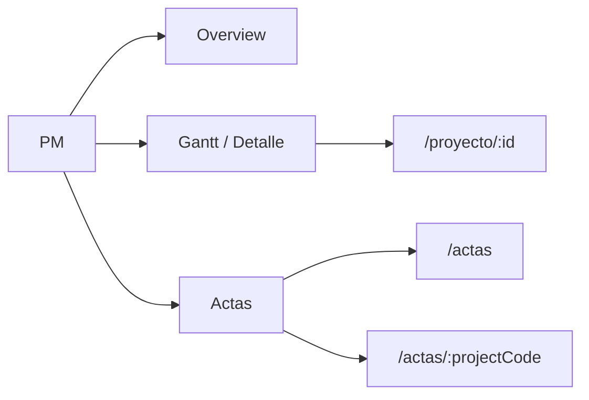
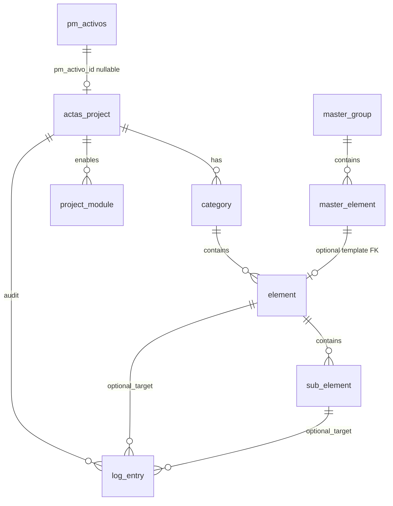

# Arquitectura — Módulo Actas

**Estado:** Decisiones cerradas (referencia para implementación)  
**Entrada:** [`00-codebase-audit.md`](./00-codebase-audit.md) · Supabase: [`02-supabase-clients.md`](./02-supabase-clients.md)

---

## Resumen

Actas es una **capacidad bajo la pestaña PM** (no un módulo de primer nivel en `MODULES`). Registro y seguimiento por proyecto con catálogo maestro, árbol categoría → elemento → sub_elemento, y log de acta.

| Tema | Decisión V1 |
|------|-------------|
| Código | `src/modules/pm/actas/` + rutas `src/app/dashboard/pm/actas/` |
| URLs | `/dashboard/pm/actas` · `/dashboard/pm/actas/[projectCode]` — slug = `project.code` |
| PM | `actas.project.pm_activo_id` → `pm_activos` (nullable FK) |
| Mutaciones | **Server Actions** por defecto; API routes solo webhooks/externos |
| Auth | Sesión `icam-auth`; todos los autenticados con `pm.actas.read` / `pm.actas.write` |
| Log | Crear: quien tenga `write`; **editar/borrar: solo el autor** |
| Maestro | Script idempotente desde `docs/actas/catalogo-maestro.xlsx` |
| Gantt ↔ Actas | **V2** |
| «Detalle proyecto» | **Convive** con Actas en V1; sustitución a valorar en V2 |

---

## 1. Ubicación en el repo

Actas no se registra en `src/registry/modules.ts`. Se extiende `pmModule` y el código vive en `src/modules/pm/actas/`.

```
src/
  app/dashboard/pm/actas/
    page.tsx                          → ActasHubPage
    [projectCode]/
      page.tsx                        → ActasProjectPage

  modules/pm/
    module.ts                         # + ruta pm.actas
    actas/
      types.ts
      data/
        readClient.ts                 # delega en getPmReadSupabase
        actasRepository.ts
        actasMasterRepository.ts
      logic/
        actas-tree.ts
        actas-permissions.ts          # RBAC + regla autor en log_entry
        actas-validation.ts
      ui/
        pages/
        components/
        hooks/
      README.md

scripts/actas/
  import-catalogo-maestro.ts          # import idempotente (ver §8)
```

| Artefacto | Ubicación |
|-----------|-----------|
| Rutas App Router | `src/app/dashboard/pm/actas/**` — solo re-export |
| Pantallas | `src/modules/pm/actas/ui/pages/` |
| Componentes | `src/modules/pm/actas/ui/components/` |
| Hooks | `src/modules/pm/actas/ui/hooks/` |
| Tipos dominio | `src/modules/pm/actas/types.ts` |
| Acceso a datos | `data/*Repository.ts` — sin carpeta `services/` |
| Queries Supabase | Solo en `data/`; clientes vía `lib/db` / `readClient` |

**No hacer:** registrar `actas` en `MODULES`; queries en `ui/` o `app/`; duplicar factories Supabase.

---

## 2. Routing y URLs

### Rutas

| Ruta | Página | Nav PM |
|------|--------|--------|
| `/dashboard/pm/actas` | Hub: listado / selector de proyectos | **Actas** |
| `/dashboard/pm/actas/[projectCode]` | Workspace del proyecto | **Actas** |

En producto se puede decir «/pm/actas»; en código y `module.ts` el prefijo real es `/dashboard/pm/...`.

### Segmento dinámico: `projectCode`

- Carpeta App Router: **`[projectCode]`** (no `[projectId]`).
- Valor en URL = **`actas.project.code`** (slug estable, único, legible).
- **No** usar UUID de `actas.project.id` en la URL.
- Resolución en servidor: `getProjectByCode(ctx, code)` antes de cargar el workspace.

### Registro en `pmModule`

```ts
{
  key: "pm.actas",
  path: "/dashboard/pm/actas",
  label: "Actas",
  match: (p) =>
    p === "/dashboard/pm/actas" ||
    p.startsWith("/dashboard/pm/actas/"),
}
```

### Convivencia con otras subpestañas PM

| Subpestaña | Ruta ejemplo | V1 |
|------------|--------------|-----|
| Overview | `/dashboard/pm/overview` | Sin cambio |
| Detalle proyecto (Gantt) | `/dashboard/pm/detalle`, `/dashboard/pm/proyecto/[id]` | **Convive** con Actas |
| Actas | `/dashboard/pm/actas`, `/dashboard/pm/actas/[projectCode]` | Nueva |

- **V2:** enlace cruzado Gantt → Actas (`/dashboard/pm/actas/{code}`) cuando exista mapping fiable vía `pm_activo_id` / `code`.
- **V2:** evaluar si Actas sustituye «Detalle proyecto» según uso real (fuera de alcance V1).

### Hub y navegación

- `defaultPath` de PM sigue siendo `/dashboard/pm/overview`.
- El hub Actas **siempre muestra listado** (sin redirigir al último proyecto en localStorage).
- Proyecto activo = **solo** el segmento `[projectCode]` en la URL.
- Sub-vistas compartibles vía query: `?tab=tree|log|modules`, etc.



---

## 3. Data fetching y mutaciones

### Stack V1

| Capa | Elección |
|------|----------|
| Persistencia | Supabase (Postgres + RLS inicial permisivo del repo) |
| Lecturas | Server Components + `getCurrentUser()` + repositorios |
| Escrituras | Repositorios + `withAudit`; invocadas desde **Server Actions** |
| Cliente interactivo | Hooks en `ui/hooks/` → Server Actions o revalidate |
| TanStack Query | **No** en V1 |
| Realtime | **No** en V1; `revalidatePath` / refresh tras mutación |

### Server Actions vs API routes

| Uso | Mecanismo |
|-----|-----------|
| CRUD actas (proyecto, árbol, `log_entry`, etc.) | **Server Actions** en `src/modules/pm/actas/` (p. ej. `actions.ts` o por dominio) |
| Import catálogo maestro (operación admin) | **Script CLI** idempotente (`scripts/actas/import-catalogo-maestro.ts`) |
| Webhooks / integraciones externas | **Route Handlers** `src/app/api/...` (solo cuando aplique) |

No crear `/api/actas/...` para flujos internos del dashboard salvo excepción externa.

### Lecturas compuestas

- `fetchActasProjectWorkspace(ctx, projectCode)` — proyecto, módulos, árbol, logs recientes (queries paralelas en el mismo repositorio).
- La página orquesta; los componentes reciben props serializables.

---

## 4. Auth y RBAC

### Sesión

- Mismo gate que el portal: cookie `icam-auth` (`src/proxy.ts`), identidad `getCurrentUser()` / `useCurrentUser()`.
- Sin Supabase Auth para login de empleados.

### Permisos (desde día 1)

Claves en `pmModule.actions` (o README Actas):

| Clave | V1 — quién |
|-------|------------|
| `pm.actas.read` | Todo usuario **autenticado** |
| `pm.actas.write` | Todo usuario **autenticado** |
| `pm.actas.admin` | Import/sync catálogo maestro (mismo universo autenticado hasta existan roles Entra) |

**Implementación V1:** comprobar sesión + presencia de la action key en helpers (`actas-permissions.ts`). No ocultar la pestaña Actas en nav para usuarios logueados.

### Regla granular (única excepción V1)

| Operación | Regla |
|-----------|--------|
| Crear `log_entry` | `pm.actas.write` |
| Editar `log_entry` | `pm.actas.write` **y** `log_entry.author_id === ctx.id` |
| Borrar `log_entry` | `pm.actas.write` **y** `log_entry.author_id === ctx.id` |

Resto de entidades (project, category, element, …): cualquier usuario con `write` en V1.

### Supabase RLS

- Tablas `actas_*` con RLS habilitado; migración inicial alineada con `temp_allow_all` del repo.
- Enforcement fino de autor en **capa aplicación** (repositorio / Server Action) para `log_entry`.
- Políticas por rol/JWT: **V2** (Entra ID).

---

## 5. Estado de la aplicación

| Estado | Source of truth |
|--------|-----------------|
| Proyecto activo | URL `/dashboard/pm/actas/[projectCode]` |
| Hub sin proyecto | `/dashboard/pm/actas` — listado neutro |
| Filtros / pestaña interna | `searchParams` si compartible; si no, `useState` local |
| Usuario | `CurrentUserProvider` / `/api/me` |

**Evitar:** Context global con `selectedProject` desincronizado de la URL.

Enlaces: `href={`/dashboard/pm/actas/${project.code}`}`.

---

## 6. Modelo de datos (alto nivel)

Prefijo de tablas: `actas_`. Sin SQL detallado en este doc.

### Diagrama



### Entidad `project` (`actas_project`)

| Campo / aspecto | Decisión |
|-----------------|----------|
| `id` | UUID interno (PK) |
| `code` | **Slug único** — va en la URL |
| `pm_activo_id` | **FK nullable** → `pm_activos.id` |
| Relaciones | 1:N `category`, `project_module`, `log_entry` |

Un proyecto Actas es entidad propia; el vínculo con Gantt es opcional vía `pm_activo_id`. No se exige 1:1 con `id_activo` en V1.

### Resto de entidades

| Entidad | Rol |
|---------|-----|
| **category** | Por proyecto; instanciada al dar de alta (desde maestro o manual) |
| **element** | N:1 `category`; opcional FK a `master_element` |
| **sub_element** | N:1 `element` |
| **log_entry** | N:1 `project`; opcional target element/sub_element; `author_id` obligatorio |
| **master_group** / **master_element** | Catálogo global; origen del import |
| **project_module** | Configuración por proyecto (qué módulos/bloques del maestro aplican) |

### Reglas V1

- Alta de proyecto: manual o derivada del catálogo; árbol copiado/instanciado desde maestro según `project_module`.
- `category` requerida para `element` (sin raíz plana suelta).
- `log_entry`: edición/borrado solo autor (ver §4); correcciones preferibles como nueva entrada si el negocio lo exige más adelante.
- Soft-delete (`deleted_at`) en entidades editables: recomendado; detalle en migración SQL.
- Adjuntos en `log_entry` (Storage): fuera de alcance V1 salvo decisión explícita en migración.

---

## 7. Import catálogo maestro

| Aspecto | Decisión |
|---------|----------|
| Fuente | [`docs/actas/catalogo-maestro.xlsx`](./catalogo-maestro.xlsx) |
| Ejecución | Script CLI **`scripts/actas/import-catalogo-maestro.ts`** |
| Semántica | **Idempotente** (re-ejecutable sin duplicar grupos/elementos maestro) |
| Permiso lógico | `pm.actas.admin` |
| UI dashboard | No es flujo principal V1; operación de mantenimiento / CI manual |

El script usa clientes de `scripts/actas/lib/` (service_role). Mapeo filas Excel → `master_group` / `master_element` se documenta en el README del módulo al implementar.

---

## 8. Backlog V2 (no bloquea V1)

| Tema | Notas |
|------|--------|
| Enlace Gantt ↔ Actas | CTA desde `ProyectoDetailPage` usando `project.code` o resolución vía `pm_activo_id` |
| Sustituir «Detalle proyecto» | Decisión de producto tras uso real |
| TanStack Query | Si hay muchos paneles cliente sincronizados |
| Realtime / subscriptions | Log colaborativo en vivo |
| RBAC Entra | Matriz rol → `pm.actas.*`; RLS por proyecto/empresa |
| Ocultar nav por permiso | Cuando existan roles reales distintos de «autenticado» |
| Adjuntos en `log_entry` | Supabase Storage |

---

## 9. Próximos pasos de implementación

1. Migración SQL `actas_*` + `project.code` unique + FK `pm_activo_id`.
2. `pmModule` + rutas `app/dashboard/pm/actas/[projectCode]/`.
3. Repositorios + `actas-permissions.ts` + Server Actions.
4. Script `import-catalogo-maestro.ts` + colocar/normalizar `catalogo-maestro.xlsx`.
5. UI: hub + workspace; sin enlace Gantt en V1.

Verificación: `npx tsc --noEmit`, `npm run build`, `npm run actas:check-supabase`.
