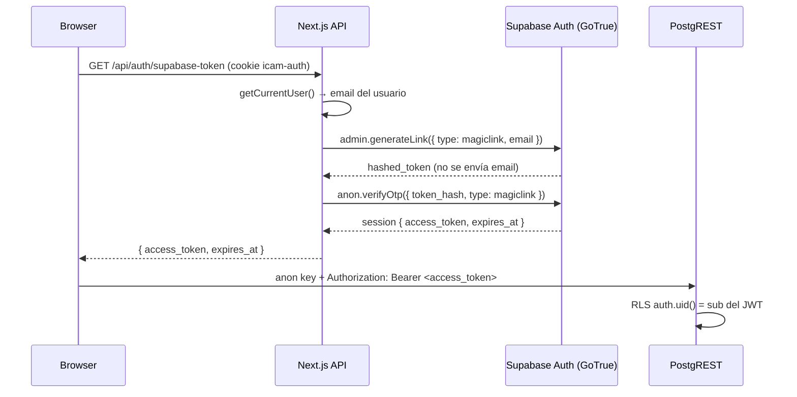

# Auth bridge ICAM ↔ Supabase (P4.0 / P4.1 refactor)

**Fecha:** 2026-05-26  
**Revisión:** P4.1 — eliminado firmado HS256 manual; usa `admin.generateLink` + `verifyOtp`.

El portal valida sesión con la cookie httpOnly `icam-auth` (login ICAM). Supabase RLS usa `auth.uid()` del JWT de Supabase Auth. El **bridge** obtiene un access token real de GoTrue para el usuario ya logueado en el portal, sin un segundo login explícito.

---

## Flujo actual (generateLink + verifyOtp)



1. El usuario inicia sesión en `/login` → cookie `icam-auth=authenticated`.
2. `createBrowserSupabaseClient()` (`src/lib/db/supabase-browser.ts`) llama a `/api/auth/supabase-token`.
3. El route handler verifica la cookie y obtiene el email del usuario logueado.
4. **Step 1 — `generateLink`**: el cliente admin (service_role) pide a GoTrue un magic link para ese email. GoTrue crea la entrada de OTP internamente y devuelve un `hashed_token`. **No se envía ningún email** — el token se consume inmediatamente en el siguiente paso.
5. **Step 2 — `verifyOtp`**: un cliente transient (anon key) canjea el `hashed_token`. GoTrue valida el OTP, crea una sesión y devuelve un JWT firmado con las **claves actuales del proyecto** (ECC P-256 o HS256 legacy). Nosotros nunca tocamos la clave privada.
6. El cliente inyecta `Authorization: Bearer <token>` en cada petición Supabase.

### Por qué abandonamos el firmado manual HS256

El proyecto Supabase usa **"JWT Signing Keys" asimétricos (ECC P-256)** como `current_key`. La clave privada no es accesible desde fuera del proyecto. El approach anterior con `SUPABASE_JWT_SECRET` (HS256 compartido) está **deprecated** para proyectos con asymmetric signing y podría dejar de funcionar en futuras versiones de Supabase.

El nuevo flujo delega la firma a GoTrue, que siempre usa las claves correctas independientemente del algoritmo configurado.

### Por qué no `signInWithPassword`

- La sesión ICAM ya está validada en servidor; no queremos credenciales de Supabase Auth en el portal.
- `magiclink` + `verifyOtp` es el mecanismo oficial para emitir sesiones desde backend sin contraseña de usuario.
- Cuando exista Entra ID / SSO, solo cambia `getCurrentUser()`; el bridge sigue igual.

### Coste en round-trips

Cada emisión de token hace **2 peticiones** a Supabase Auth (`generateLink` + `verifyOtp`). La caché de 5 min en el cliente browser (`supabase-browser.ts`) limita las llamadas a ~12 emisiones/hora por usuario activo.

---

## Variables de entorno

| Variable | Dónde | Uso |
|----------|--------|-----|
| `NEXT_PUBLIC_SUPABASE_URL` | Cliente + servidor | URL del proyecto |
| `NEXT_PUBLIC_SUPABASE_ANON_KEY` | Cliente + servidor | Clave anon para `verifyOtp` |
| `SUPABASE_SERVICE_ROLE_KEY` | Solo servidor | `generateLink` + resolver `auth.users` |
| `ACTAS_AUTH_BRIDGE_TEST_EMAIL` | Scripts | Email para `npm run actas:test-auth-bridge` |

> **`SUPABASE_JWT_SECRET` ya no es necesaria.** Se eliminó de `.env.local.example`.

---

## Expiración y refresh

| Evento | Comportamiento |
|--------|----------------|
| Emisión | TTL determinado por GoTrue (~1 h) |
| < 5 min para `expires_at` | El cliente vuelve a llamar `/api/auth/supabase-token` |
| Token expirado en Supabase | PostgREST devuelve error / 0 filas; el cliente re-fetcha si la cookie ICAM sigue válida |
| Logout ICAM | Borrar cookie; llamar `clearSupabaseBridgeTokenCache()` en cliente |
| Cookie ICAM ausente | `/api/auth/supabase-token` → **401** |

Tras logout:

```ts
import { clearSupabaseBridgeTokenCache } from "@/lib/db/client";
clearSupabaseBridgeTokenCache();
```

---

## Alta de nuevos usuarios

RLS exige **dos** pasos:

1. **Supabase Auth** — fila en `auth.users` con el mismo email que usará `getCurrentUser()`:
   - Dashboard → Authentication → Add user, o
   - `npm run actas:auth-bulk-create` (desde mapeo Monday), o
   - `auth.admin.createUser` con service role.

2. **Membresía org** — insert en `org_member`:

```sql
INSERT INTO org_member (organization_id, user_id, role)
SELECT o.id, '<uuid-auth-users>', 'member'
FROM organization o
WHERE o.slug = 'icam';
```

Sin `org_member`, el token es válido pero `project` devuelve **0 filas** (política `user_can_access_project`).

El bridge devuelve **404** (vía `generateLink` error) si el email ICAM no existe en `auth.users`.

---

## Archivos

| Archivo | Rol |
|---------|-----|
| `src/app/api/auth/supabase-token/route.ts` | Endpoint GET del bridge |
| `src/lib/auth/issue-supabase-token.ts` | Orquestación: `generateLink` + `verifyOtp` |
| `src/lib/auth/resolve-auth-user.ts` | Email → `auth.users.id` (usado por otros contextos) |
| `src/lib/db/supabase-browser.ts` | Cliente navegador con Bearer + caché 5 min |
| `src/lib/db/client.ts` | Re-export `createClient()` |

`src/lib/auth/supabase-jwt.ts` — **eliminado** en P4.1.

---

## Verificación

```bash
npm run actas:test-auth-bridge
```

Comprueba:

1. Cliente **anon** sin JWT → 0 proyectos.
2. Token obtenido vía `generateLink` + `verifyOtp` → puede leer `project` (RLS).
3. Token inválido (string basura) → sin acceso.

---

## Relación con RLS

Ver [04-rls.md](./04-rls.md). El cliente browser **debe** usar el bridge; `anon` sin Bearer no ve datos operativos.
